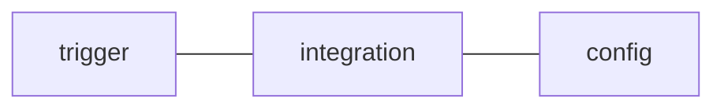

# Using the Task Badger CLI

The CLI (command line interface) is a tool that allows you to interface with
Task Badger via the shell. This makes it easy to integrate it into workflows
without the need to write any code.

## Installation

The CLI is bundled with the Python client library. To install it you need:

* Python > X

```shell
$ python -m pip install -U taskbadger
```

## Monitoring processes

The main feature of the CLI is the `run` command which allows you to track tasks
that are started from the command line:

```bash
$ taskbadger run "demo task" -- path/to/script.sh

Task created: https://taskbadger.net/public/tasks/xyz/
```

The task status will be updated once the command completes. The task status
will be `success` if the command has a zero exit code. Any other exit code
will result in an `error` status and the exit code will be saved in the
task data under the `return_code` key.

### Actions

You can create actions for CLI tasks using the `--action` (`-a`) argument. The
format for this argument is string with three components, separated by a space:



The config parameter is a comma-separated list of key value pairs.

Here is an example:

```bash
$ taskbadger run "demo task" --action error email to:me@test.com -- path/to/script.sh
```

If the task state becomes `stale` or `error`, use the `email` integration to
send a notification to `me@test.com`.

## Configuration

The CLI requires the same configuration as the API. This can be provided in one of
three ways (in order of precedence):

1. Command line arguments
2. Environment variables
3. Config file

Values provided via environment variables override values in the configuration file
and values provided via the command line override both environment config and the
configuration file.

Details about the configuration parameters can be found [here](basics.md#organization-and-project)

### Command line arguments

Running `taskbadger -h` will show you the command line help. 
  
```bash
 $ taskbadger -h
                                                                                                            
 Usage: taskbadger [OPTIONS] COMMAND [ARGS]...                                                              
                                                                                                            
 Task Badger CLI                                                                                            
                                                                                                            
╭─ Options ──────────────────────────────────────╮
│ --org                 -o   TASKBADGER_ORG      │
│                                                │
│ --project             -p   TASKBADGER_PROJECT  │
╰────────────────────────────────────────────────╯
```

The API Key can not be provided via the command line as a security measure to prevent logging
of the API Key.

### Environment variables

Use the following environment variable names to configure the CLI:

* `TASKBADGER_API_KEY`
* `TASKBADGER_ORG`
* `TASKBADGER_PROJECT`

### Configuration file

The CLI includes a convenience command to create the configuration file. Running the `configure`
command will prompt you for the configuration parameters and save them to the configuration
file.

```bash
$ taskbadger configure

Organization slug: my-org 
Project slug: project-x 
API Key: XYZ.ABC 

Config written to ~/.config/taskbadger/config
```
