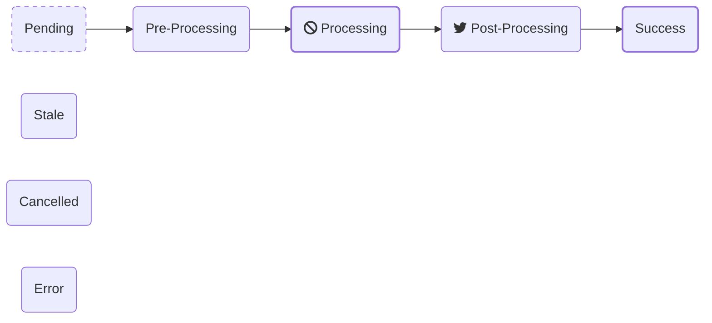

# Task Badger's Data Model

!!!tip

        You can view and download the OpenAPI schema from
        [https://taskbadger.net/api/docs/](https://taskbadger.net/api/docs/){:target="_blank"}

## Task

Naturally, the **Task** is the core data model for Task Badger. Almost all operations are related
to a task. 

Every Task must belong to a **Project**. You can think of a project as a single 'system' or piece of software.
Assigning tasks to a Project is useful when it comes to data segregation and metrics.

The main attributes or a task are:

`name`

:   Each task should have a **name** which identifies the type of task, not necessarily the specific instance
    of the task. For example, `account.export_transactions` may be the name of a task that is executed to
    compile a data export for download.

`status`

:   The **status** of the task indicates where it is in the [task lifecycle](#task-lifecycle)

`value`

:   The **value** of a task indicates its progress in the [`processing`](#state-processing) state. By default,
    the value range is from 0 to 100 (see **value_max**). 

`value_max`

:   This represents the **value** a task is expected to reach when it is complete.
    The default for **value_max** is **100**, but it can be changed to any value e.g. the total number o
    items to be processed.

`value_percent`

:   This is a computed percentage which is equivalent to `100 * value / value_max`. This will be `null`
    if **value** is null.

`data`

:   This can be used to store arbitrary JSON data that may be useful to store along with the task such
    as task arguments.

`max_runtime`

:   This value can be used in conjunction with task actions and monitors to trigger actions if a task
    exceeds its expected runtime. The value is in seconds.

`stale_timeout`

:    This represents the maximum number of seconds allowed between task updates. If a task does not receive
     updates within this period it will be marked as 'stale'.

<a name="tags"></a>
`tags`

:   A list of tags that can be used to categorize tasks. Tags are useful for filtering tasks in the UI. Each tag
    has a name and a value. For example, a task may have a tag `environment:production`.

### Example Task

```json
{
  "id": "57ae8eVBrH7jbDgmYj6Ut2vR9S",
  "organization": "example_org",
  "project": "example_project",
  "name": "example task",
  "status": "processing",
  "value": 42,
  "value_max": 200,
  "value_percent": 21,
  "data": {
    "property1": "customValue"
  },
  "max_runtime": null,
  "stale_timeout": null,
  "start_time": "2022-08-24T15:15:22Z",
  "end_time": null,
  "created": "2022-08-24T14:15:22Z",
  "updated": "2022-08-24T16:15:22Z",
  "url": "https://taskbadger.net/a/{example_org/tasks/57ae8eVBrH7jbDgmYj6Ut2vR9S/",
  "public_url": "https://taskbadger.net/public/tasks/57ae8eVBrH7jbDgmYj6Ut2vR9S/",
  "tags": [
    {"environment": "production"}
  ]
}
```

## Task Lifecycle

The potential lifecycle of a task has 4 incremental states and 3 terminal states. A task would usually only
ever take on one terminal state and may use any or all of the incremental states. 


Here are some examples:

**Manual data migration**

1. The data migration script is executed from the command line by an operator. Immediately on starting
   it creates a task in the `processing` state with a value of `0`.
2. The script iterates through rows from a database query and performs some action with each. At regular
   intervals the script updates the task with its progress by updating the `value` attribute.
3. Upon completion the script updates the task status to `success`.


**User initiated data export**

1. A user makes a request for data via a web UI. A request is made to Task Badger to create a task record
   in the `pending` state. The task ID and other parameters are placed in a queue. The user is then directed
   to a UI which shows the task status and progress.
2. On the backend a task worker receives the task from the queue and executes the export function.
3. The export function updates the Task Badger task state to `processing` and the `value` to 0 before
   starting the export.
4. During the data export the export function regularly updates the task progress which is also displayed
   on the UI for the user.
5. Once the export is compiled the export function updates the task value to 100 and the state to
   `post_processing`. During this time the export function uploads the compiled export to S3.
6. Once the upload is complete the task status is updated to `success` and the user is presented with
   an option to download the export.

At any point during this process the user may press *Cancel* on the UI which will update the task status.
The backed export function could check the task state periodically and exit early.

### Task state detail

#### Initial states
<a id="state-pending"></a>`pending`

:   Prior to starting execution a task may be in pending state. This typically happens while a task is
    waiting in a queue before being selected for execution by a task worker.


#### Execution states
<a id="state-pre_processing"></a>`pre_processing`

:   In this state a task has not yet begun iterating through its dataset, but it may be doing preliminary
    work. For example, loading data from a file prior to iterating.

<a id="state-processing"></a>`processing`

:   This is the main state of a task during which it is iterating through the data and incrementing its
    progress as it goes by updating its `value`.

<a id="state-post_processing"></a>`post_processing`

:   Having completed processing a task may perform additional work to clean up or finalize the task.

#### Terminal states
These states are mutually exclusive, once a task reaches one of these states it is not expected to be
modified again (with the potential exception of 'stale').

<a id="state-success"></a>`success`

:   The task has completed successfully. Typically, a task would move to this state from the `processing` or
    `post_processing` state.

<a id="state-error"></a>`error`

:   The task has errored. A task may take on this state at any point.

<a id="state-cancelled"></a>`cancelled`

:   The task has been cancelled. A task may take on this state at any point.


#### Other states

<a id="state-stale"></a>`stale`

:   The task has become stale. This will happen if the task has not reached one of the terminal
    states AND the duration since it's last update exceeds the tasks `stale_timeout` value (seconds). The
    transition to this state is managed by Task Badger automatically. A task in this state may transition
    to any other state via an update.


## Task Actions

Actions are at the core of Task Badger's secret sauce. They allow you to send notifications, perform callouts,
and more based on task events.

Every action specifies an [integration](integrations.md) e.g. `email`, and a trigger definition which is
like a crontab expression, but for tasks. For example, `*/25%,success` means, "execute
this action when the task value passes 25%, 50%, 75%, 100% and when the task status
is set to `success`".

A task may have multiple actions, each with their own integration and trigger definition.

Here is an example of an action:

```json
{
  "id": 640,
  "task": "57ae8eVBrH7jbDgmYj6Ut2vR9S",
  "trigger": "success,error",
  "integration": "email",
  "status": "active",
  "config": {
    "to": "me@example.com,you@example.com"
  },
  "created": "2022-11-16T07:10:30.551808Z",
  "updated": "2022-11-16T07:10:30.551818Z"
}
```

### Action Triggers

An action trigger is a comma-separated list of trigger points. Each trigger point is one of the following:

* A numeric value which is matched against the task `value`.
* A percentage value which is matched against the task `value_percent`.
* A task status which is matched against the task `status`.
* A special value `max_runtime_exeeded` which is matched when the task exceeds its `max_runtime` value.

Numeric and percentage trigger points can also be prefixed with `*/` to indicate that the trigger should
fire at regular intervals. For example, `*/50%` will fire at 0%, 50% and 100%.

Examples:

| Trigger               | Trigger Fire Points                                                          |
|-----------------------|------------------------------------------------------------------------------|
| `*/30%`               | When `value_percent` passes any multiple of 30%: 0%, 30%, 60%, 90%           |
| `success,error,stale` | When the state changes to any of the listed states                           |
| `95%,250,error`       | At 95%, when the value reaches or passes 250, when the state becomes `error` | 

### Action Edge cases

If a task value or status skips past multiple trigger points, only the last matching trigger will be
executed.

For example, an action configured with `20,40,80` whose value goes from `0` directly to `90` will
skip over the `20` and `40` events and only fire the `80` event. This also applies to task
status triggers.

This also applies to multiple trigger points that are reached simultaneously, for example, let's say
an action has the following trigger: `100,success`. It is quite likely that the task could reach
both those states at the same time but the action will only fire once.
