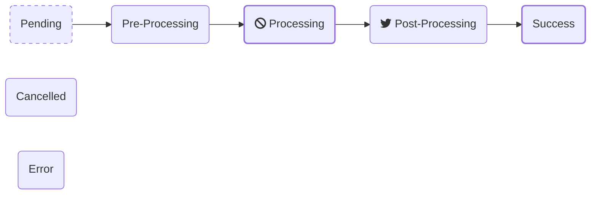

# Task Badgers' Data Model

## Task

Naturally, the **Task** is the core data model for Task Badger. Almost all operations are related
to a task. 

Every Task must belong to a **Project**. You can think of a project as a single 'system' or piece of software.
Assigning tasks to a Project is useful when it comes to data segregation and metrics.

Tasks have three main attributes:

`name`

:   Each task should have a **name** which identifies the type of task, not necessarily the specific instance
    of the task. For example, `account.export_transactions` may be the name of a task that is executed to
    compile a data export for download.

`status`

:   The **status** of the task indices where it is in the [task lifecycle](#task-lifecycle)

`value`

:   The **value** of a task indicates its progress in the [`processing`](#state-processing) state. By default,
    the value range is from 0 to 100. This attribute is you can track a tasks active progress. 

## Task Lifecycle

The potential lifecycle of a task has 4 incremental states and 3 terminal states. A task would usually only
ever take on one terminal state and may use any or all of the incremental states. 

Here are some examples:

**Manual data migration**

1. The data migration script is executed from the command line by an operator. Immediately on starting
   it creates a task in the `processing` state with a value of `0`.
2. The script iterates through rows from a database query and performs some action with each. At regular
   intervals the script updates the task with its progress by updating the `value` attribute.
3. Upon completion the script updates the task status to `success`.

**User initiated data export**

1. A user makes a request for data via a web UI. A request is made to Task Badger to create a task record
   in the `pending` state. The task ID and other parameters are placed in a queue. The user is then directed
   to a UI which shows the task status and progress.
2. On the backend a task worker receives the task from the queue and executes the export function.
3. The export function updates the Task Badger task state to `processing` and the `value` to 0 before
   starting the export.
4. During the data export the export function regularly updates the task progress which is also displayed
   on the UI for the user.
5. Once the export is compiled the export function updates the task value to 100 and the state to
   `post_processing`. During this time the export function uploads the compiled export to S3.
6. Once the upload is complete the task status is updated to `success` and the user is presented with
   an option to download the export.

At any point during this process the user may press *Cancel* on the UI which will update the task status.
The backed export function could check the task state periodically and exit early.

### Task state detail

#### Initial states
`pending`

:   Prior to starting execution a task may be in pending state. This typically happens while a task is
    waiting in a queue before being selected for execution by a task worker.

#### Execution states
`pre_processing`

:   In this state a task has not yet begun iterating through its dataset, but it may be doing preliminary
    work. For example, loading data from a file prior to iterating.

`processing`

:   This is the main state of a task during which it is iterating through the data and incrementing its
    progress as it goes by updating its `value`.

`post_processing`

:   Having completed processing a task may perform additional work to clean up or finalize the task.

#### Terminal states
These states are mutually exclusive, once a task reaches one of these states it is not expected to be
modified again.

`success`

:   The task has completed successfully. Typically, a task would move to this state from the `processing` or
    `post_processing` state.

`error`

:   The task has errored. A task may take on this state at any point.

`cancelled`

:   The task has been cancelled. A task may take on this state at any point.
