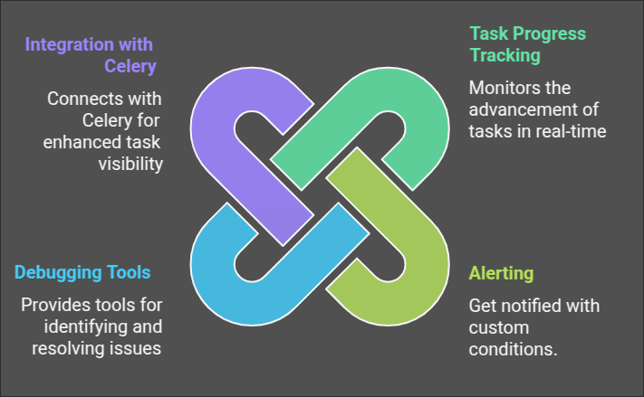

# Welcome to Task Badger Documentation

Task Badger is a specialized monitoring system designed to provide deep visibility into your background jobs and asynchronous tasks. While it doesn't handle task execution itself, Task Badger seamlessly integrates with popular task processing systems like Celery to give developers comprehensive insights into their task operations. With Task Badger, you can track task progress, analyze performance patterns, and debug issues across your distributed task processing infrastructure. Whether you're managing a small set of periodic jobs or orchestrating complex distributed workflows, Task Badger offers the monitoring and observability tools you need to ensure your tasks are running smoothly.

## Key Features

- **Task States**: Track the status of tasks with various states such as `pending`, `in_progress`, `completed`, `error`, and more.
- **Actions and Triggers**: Automate actions based on task events using flexible trigger definitions.
- **Integrations**: Connect with various services like email, webhooks, and more to extend the functionality of Task Badger
- **Monitoring and Alerts**: Stay informed with real-time monitoring and customizable alerts for task events.

## Getting Started

To get started with Task Badger, check out the following sections:

- [Quick Start Guide](quick.md): Learn how to set up and start using Task Badger.
- [Task States](data_model.md): Understand the different states a task can be in and how they are managed.
- [Task Actions](data_model.md#task-actions): Discover how to configure actions and triggers to automate your workflows.
- [API Reference](api.md): Explore the API documentation to integrate Task Badger with your applications.
- [Python SDK](python.md): Get started with the Python SDK to interact with Task Badger programmatically.

## Community and Support

Join our community to get help, share ideas, and stay updated with the latest news:

- [GitHub](https://github.com/Task Badger): Report issues, contribute to the project, and browse the source code.
- [Twitter](https://twitter.com/@task_badger): Follow us for updates and announcements.

We hope you find Task Badger useful and look forward to your feedback!# Welcome to Task Badger Documentation
